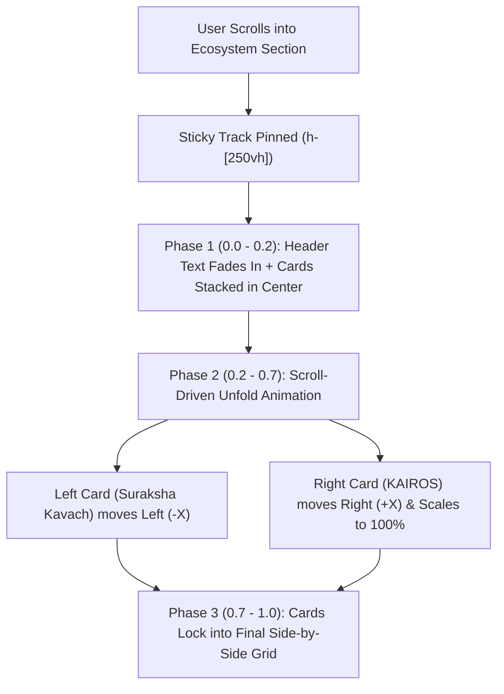

# 📜 Card Animation Plan: "Our Core Ecosystem" Section

## 🎯 Overview & Concept
We are adding a **Scroll-Driven Stack Unfolding Animation** to the **Our Core Ecosystem** section.

### 📱 Visual Sequence:
1. **Initial View (Scroll Start)**:
   - Header text ("Our Core Ecosystem" & description) fades in cleanly at the top of the sticky section.
   - The two cards (**Suraksha Kavach** and **KAIROS - AI Edge Box**) start **stacked directly on top of each other** in the center of the screen.
   - Card 1 (Suraksha Kavach) sits on top; Card 2 (KAIROS) sits stacked slightly behind with a subtle scale (`0.95`), slight offset, and tilt.

2. **As You Scroll (Interactive Motion)**:
   - As the user scrolls down, both cards smoothly animate outwards from the center stack:
     - **Suraksha Kavach** moves left into its left column position.
     - **KAIROS - AI Edge Box** moves right into its right column position.
     - Card rotations straighten to `0deg` and Card 2 scales up to `1.0`.

3. **Scroll Final State**:
   - Both cards rest perfectly side-by-side in their original 2-column grid layout as seen on the site today.

---

## 🏗️ Technical Architecture & Implementation Details

### ⚡ Technical Details:
- **Framework**: `framer-motion` (`motion/react`) using `useScroll`, `useTransform`, and `useSpring` for Lenis-smooth scroll response.
- **Container**: `h-[250vh]` sticky scroll driver to allow natural, controlled scroll distance for the animation.
- **Mobile Adaptability**: On mobile screens (`< 768px`), cards will stack vertically with a sleek scroll fade/slide up to ensure smooth touch scrolling without page-lock issues.
- **Component**: We can modularize this into a dedicated component [`components/core-ecosystem-section.tsx`](file:///d:/Projects/KavachX/components/core-ecosystem-section.tsx) and import it clean into `home-client.tsx`.

---

## ❓ Confirmation
Please review the plan above. Click **Proceed** or let me know if you would like any adjustments to the stack offsets, scroll distance, or animation effects!
